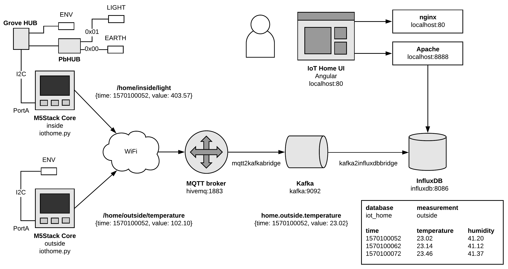
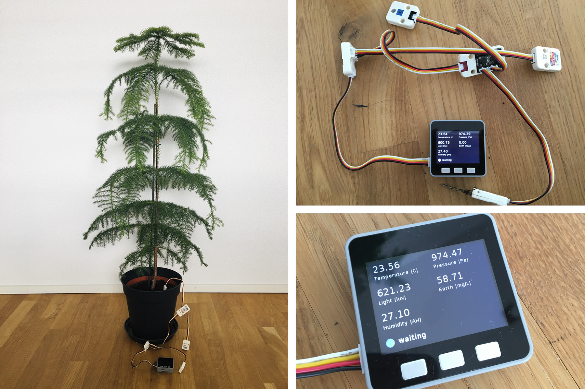
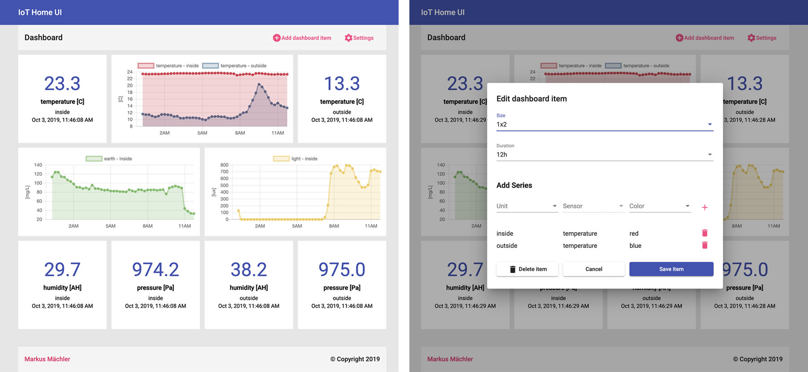

# IoT Home

This project shows how to setup an advanced IoT environment for your own home. It uses hardware from [M5Stack](https://m5stack.com/), 
a data stream pipeline consisting of an [MQTT](http://mqtt.org/) broker, [Kafka](https://kafka.apache.org/) and [InfluxDB](https://www.influxdata.com/) and an [Angular](https://angular.io/) app to visualize the data.
All the applications run in docker containers and thus can easily be deployed to a single home server.

## System overview



## M5Stack

### Setup

- Install USB to UART driver from [silabs](https://www.silabs.com/products/development-tools/software/usb-to-uart-bridge-vcp-drivers)
- Upload the firmware `UIFlow-v1.3.5-beta` to your M5Stack core using [M5Burner](https://m5stack.com/pages/download)
- Install Visual Studio Code with [M5Stack extension](https://marketplace.visualstudio.com/items?itemName=curdeveryday.vscode-m5stack-mpy)
- Install [SiLabsUSBDriverDisk](https://m5stack.com/pages/download)
- Connect your M5Stack device to your computer via USB
- Connect all your sensors to your M5Stack core
- Switch your M5Stack core to USB mode: `startup -> press button C -> USB mode`
- Startup Visual Studio Code and connect to your M5Stack
- Upload the files from the folder `./m5stack` to your device
- Configure your WiFi credentials
- Configure your MQTT broker and active sensors in `iot_home.py`
- Run the program



## Docker

- Install [docker](https://docs.docker.com/install/) on your system
- Clone this repository
- Use `docker-compose up` to startup all the containers (Caution: setup InfluxDB authentication first if needed.)

### IoT Home UI

IoT Home UI is an Angular app used to visualize the data, it is maintained in a separate repository: https://github.com/maechler/iot-home-ui

Enter `localhost` or your server's IP address in the browser, setup the connection to InfluxDB and start adding tiles.



### InfluxDB

#### Enable Authentication

- Copy `./influxdb/env-variables.env.dist` to `./influxdb/env-variables.env`
- Configure usernames and passwords 

#### Connect to InfluxDB

Use `docker ps` to find out the container ID of InfluxDB and then use this ID to connect to the database with `docker exec -it [influxdb container id] influx`.

Useful SQL Queries:

```sql
SHOW DATABASES;

USE iothome;

SHOW MEASUREMENTS;

SELECT * FROM iothome.DefaultPolicy.inside;
SELECT * FROM iothome.DefaultPolicy.inside ORDER BY DESC LIMIT 1;
```

#### InfluxDB API

InfluxDB comes with a built in web API. It requires the two parameters `db` for the database and `q` for the query, e.g. `http://localhost:8086/query?db=iothome&q=SELECT%20*%20FROM%20iothome.DefaultPolicy.inside;`.

### Kafka

Following the [Kafka quickstart guide](https://kafka.apache.org/quickstart) you can easily connect to the Kafka topics directly:

```bash
bin/kafka-topics.sh --list --bootstrap-server localhost:9092
bin/kafka-console-consumer.sh --bootstrap-server localhost:29092 --topic "home.*" --from-beginning`
```

### HiveMQ

You can use the [Websocket client](http://www.hivemq.com/demos/websocket-client/) to connect to your HiveMQ broker directly.

### Apache

We need Apache as a reverse proxy because InfluxDB does not allow to set `Access-Control-Allow-Origin` headers.

### Kafka to InfluxDB Bridge

A simple Java application to connect Kafka to InfluxDB: [GitHub](https://github.com/maechler/kafka2influxdbbridge) and [Docker](https://hub.docker.com/r/marmaechler/kafka2influxdbbridge)

### MQTT to Kafka Bridge

A simple Java application to connect MQTT to Kafka: [GitHub](https://github.com/maechler/mqtt2kafkabridge) and [Docker](https://hub.docker.com/r/marmaechler/mqtt2kafkabridge)
